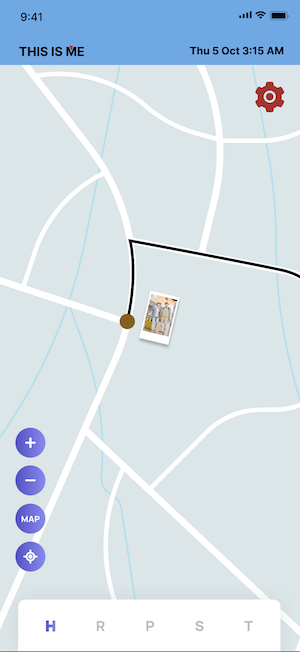

# LIFE PATH

## Introduction

More than just a photo album, **LIFE PATH** tracks your adventures in an interactive timeline enriched with tags, notes, and media. The app allows users to record their life moments through **voice memos, pictures, notes, and timestamps**, compiling them into a beautifully structured timeline.

## Features

### 1. **User Registration & Profile Creation**
   - Users can create an account with their **name, email, phone number, and password**.
   - **Login system** with "Keep me signed in" and "Forgot Password" options.
   - **Beneficiary setup** to transfer the timeline upon passing.

### 2. **Personal Timeline**
   - Automatically generates a timeline using **images, videos, notes, and location data**.
   - Integrated with a **map** to display travel routes.

### 3. **Moment Recording**
   - Users can capture **photos**, **write notes**, and **record voice memos**.
   - Tagging functionality for easy categorization and searching.
   - Ability to **set date, time, weather conditions, and location** for each moment.

### 4. **Navigation Bar**
   - **Home** – Displays the user’s timeline with travel routes.
   - **Route** – Shows a map of traveled routes.
   - **Photos** – Collection of uploaded images.
   - **Search** – Allows filtering moments by name, date, location, or weather.
   - **Tags** – Displays photos and their respective tags.

### 5. **Editing & Management**
   - Users can edit timeline entries (add/remove photos, notes, voice memos, location, and timestamps).
   - Color-coded travel modes:
     - **Land**: Black
     - **Air**: White
     - **Sea**: Blue

### 6. **Integrations**
   - **Map Integration** for location tagging and travel tracking.
   - **Email Integration** for password recovery.

### 7. **Admin Features**
   - Full control over user management (add/remove users).
   - Generate reports on user activity.

## Screenshots

Screenshots are available in the `.github` folder:
- **Login Page**:  
   
- **Timeline**:  
   
- **Search Routes**:  
   
- **Photo Section**:  
   
- **Tracking System**:  
   
